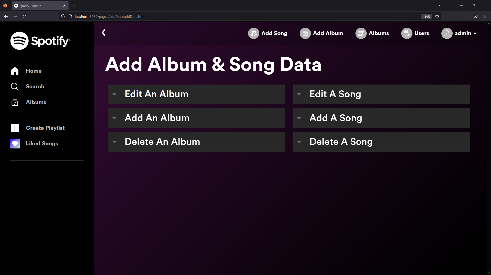
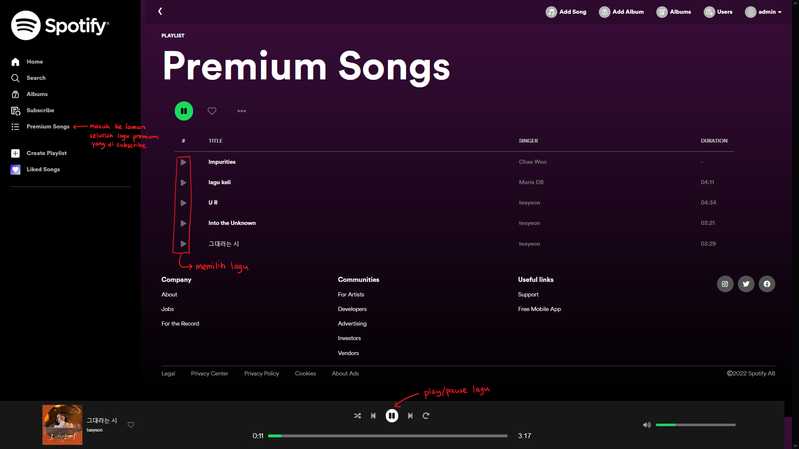

<a name="readme-top"></a>
<br />
<div align="center">
  <a href="https://gitlab.informatika.org/if3110-2022-k01-02-32/ngnotify-app">
    
  </a>

  <h3 align="center">Ngnotify</h3>

  <p align="center">
    :indonesia: Platform Mendengar Lagu Karya Anak Bangsa :indonesia:<br>
    Penantang Search Engine Gatot Kaca Sebagai Karya Terbaik Anak Bangsa
</div>


<!-- TABLE OF CONTENTS -->
<details>
  <summary>Table of Contents</summary>
  <ol>
    <li>
      <a href="#about-the-project">About The Project</a>
      <ul>
        <li><a href="#built-with">Built With</a></li>
      </ul>
    </li>
    <li>
      <a href="#getting-started">Getting Started</a>
      <ul>
        <li><a href="#dependencies">Dependencies</a></li>
        <li><a href="#prerequisites">Prerequisites</a></li>
        <li><a href="#installation">Installation</a></li>
      </ul>
    </li>
    <li><a href="#changes">Changes</a></li>
    <li><a href="#usage">Usage</a></li>
    <li><a href="#contributions">Contributions</a></li>
    <li><a href="#contact">Contact</a></li>
  </ol>
</details>


<!-- ABOUT THE PROJECT -->
## About The Project

Ngnotify adalah sebuah web app untuk memutar lagu yang ~menjiplak~ terinspirasi dari salah satu platform streaming lagu paling populer di dunia yakni Spotify. Web app ini dibuat untuk memenuhi ~Tugas Besar 1 IF3110 Teknik Informatika ITB~ panggilan negara untuk mencintai produk karya anak bangsa. Karena itu, kami membuat sebuah produk lokal agar terdapat produk Indonesia untuk dicintai :heart:heart:heart

Sebagai pesaing terbesar Search Engine Gatot Kaca untuk gelar aplikasi anak bangsa terbaik, tentu saja Ngnotify memiliki fitur yang sangat ~tidak~ lengkap. Ngnotify memiliki fitur login, register, add edit delete album dan lagu, play pause lagu, dan pastinya search lagu dengan search engine yang sangat ~cupu~ bagus.

<p align="right">(<a href="#readme-top">back to top</a>)</p>


### Built With

* HTML
* CSS
* Javascript
* PHP
* Udah itu aja soalnya ~ITB style #kaloAdaYangSusahKenapaHarusYangGampang~ Vanilla Web App

<p align="right">(<a href="#readme-top">back to top</a>)</p>


<!-- GETTING STARTED -->
## Getting Started

Tanpa Berlama-lama inilah cara menjalankan web app

### Dependencies
Agar Program dapat berjalan dengan baik, silahkan install juga repo-repo berikut:

```
https://gitlab.informatika.org/if3110-2022-k01-02-32/ngnotify-premium-app
```
```
https://gitlab.informatika.org/if3110-2022-k01-02-32/ngnotify-rest-service
```
```
https://gitlab.informatika.org/if3110-2022-k01-02-32/ngnotify-soap-service
```

### Prerequisites

* Docker
    ```sh
    https://www.docker.com/
    ```
* Git
    ```sh
    https://git-scm.com/downloads
    ```
* Internet (karena Database online)
* Kesabaran (karena akses data sering kali lemot - <i>maklum gratis</i>)
* Jika ingin mengubah database menjadi local, silahkan konfigurasi di
    ```sh
    scripts/serverside/app/constants/base.php
    ```
setelah itu silahkan setting sendiri databasenya dari file dump :smile:. Jika tidak bisa, silahkan tanya yang bisa (Baca: google/stackoverflow/temen~kalo punya~)

### Installation


1. Clone Repo ini dengan menggunakan cmd pada directory yang diinginkan
    ```sh
    C:\Users\MerekLaptop> 
    git clone https://gitlab.informatika.org/if3110-2022-k01-02-32/ngnotify-app
    ```
2. Buka Directory tempat file di clone
   ```sh
   C:\Users\MerekLaptop> cd ngnotify-app
   C:\Users\MerekLaptop\ngnotify-app>
   ```
3. Jalankan docker 
   ```sh
   C:\Users\MerekLaptop\ngnotify-app>
   docker-compose up -d
   ```
4. buka http://localhost:8080 di ~chrome~ browser favorit kalian
5. Ngnotify siap untuk dipakai secara terbatas 
6. Untuk menggunakan seluruh layanan web, jalankan seluruh (<a href="#dependencies">dependencies</a>) yang ada
7. Jika dependencies sudah dijalankan, Ngnotify siap untuk dipakai secara full :smile:
<p align="right">(<a href="#readme-top">back to top</a>)</p>

<!-- USAGE EXAMPLES -->
## Usage

1. Login


2. Register


3. Home


4. Album


5. Detail Album


6. Detail Song


7. Search Sort Filter


8. Add Data



9. List User


10. List Penyanyi Premium


11. List Song


<p align="right">(<a href="#readme-top">back to top</a>)</p>

## Changes

1. Penambahan link pada navbar ke fitur List Penyanyi Premium dan List Song Premium

2. Pengubahan field pada halaman List User


<!-- CONTRIBUTING -->
## Contributions
* Client-side (html,css,js)

|feature|13520019|13520034|13520040|
|-------|--------|--------|--------|
|adddata|:heavy_check_mark:|:heavy_check_mark:|:heavy_check_mark:|
|albums|:heavy_check_mark:|:heavy_check_mark:|:heavy_check_mark:|
|detailAlbum|:heavy_check_mark:||:heavy_check_mark:|
|detailSong|:heavy_check_mark:||:heavy_check_mark:|
|home|:heavy_check_mark:|:heavy_check_mark:|||
|listuser|:heavy_check_mark:|:heavy_check_mark:||
|login|:heavy_check_mark:|:heavy_check_mark:|:heavy_check_mark:|
|register|:heavy_check_mark:|:heavy_check_mark:|:heavy_check_mark:|
|searchSortFilter|:heavy_check_mark:|:heavy_check_mark:|:heavy_check_mark:|
|listSinger|:heavy_check_mark:|:heavy_check_mark:|:heavy_check_mark:|
|listSong|:heavy_check_mark:|:heavy_check_mark:|:heavy_check_mark:|

* Server-side(php)

|feature|13520019|13520034|13520040|
|-------|--------|--------|--------|
|Docker||:heavy_check_mark:|:heavy_check_mark:|
|Routing|||:heavy_check_mark:|
|Core DB||:heavy_check_mark:|:heavy_check_mark:|
|User DB and API|:heavy_check_mark:|:heavy_check_mark:|:heavy_check_mark:|
|Song DB and API|:heavy_check_mark:|:heavy_check_mark:|:heavy_check_mark:|
|Album DB and API|:heavy_check_mark:|:heavy_check_mark:|:heavy_check_mark:|
|Subscription DB and API|:heavy_check_mark:|:heavy_check_mark:|:heavy_check_mark:|

* both

|feature|13520019|13520034|13520040|
|-------|--------|--------|--------|
|AJAX|:heavy_check_mark:|:heavy_check_mark:|:heavy_check_mark:|

<p align="right">(<a href="#readme-top">back to top</a>)</p>


<!-- LICENSE -->
## License

Distributed under the NG License. See you again for more information.

<p align="right">(<a href="#readme-top">back to top</a>)</p>


<!-- CONTACT -->
## Contact
|Name|Contact|Github|
|----|-------|------|
|Maharani Ayu Putri Irawan | 13520019@std.stei.itb.ac.id| <a href="https://www.github.com/rannnayy">@rannnayy</a>|
|Bryan Bernigen | 13520034@std.stei.itb.ac.id |<a href="https://www.github.com/Nk-Kyle">@Nk-Kyle</a>|
|Ng Kyle | 13520040@std.stei.itb.ac.id|<a href="https://www.github.com/bryanbernigen">@bryanbernigen</a>|

<p align="right">(<a href="#readme-top">back to top</a>)</p>
